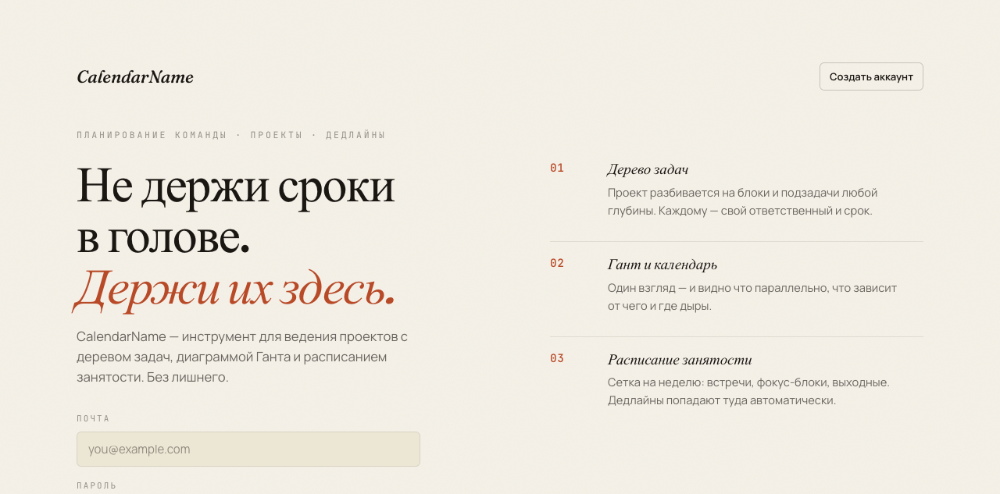
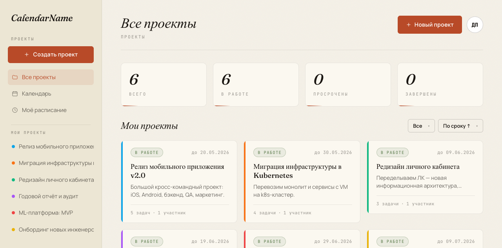
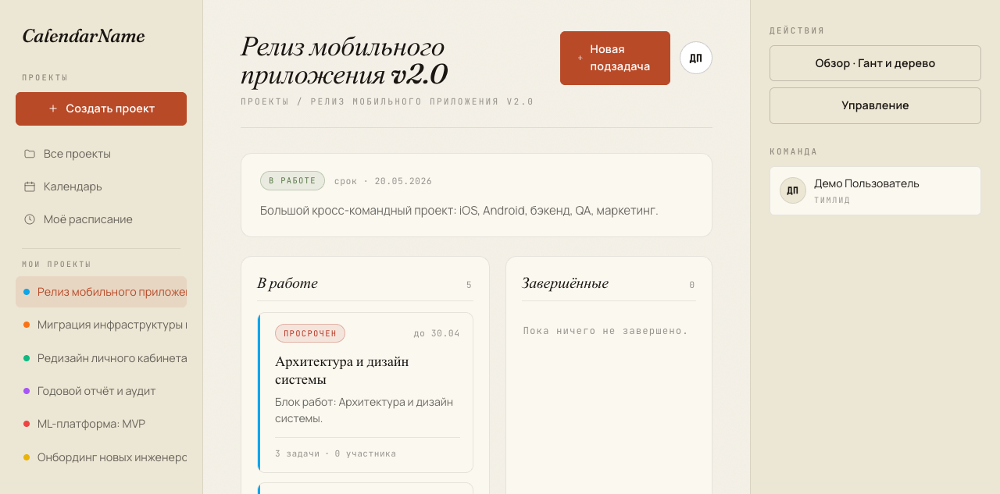
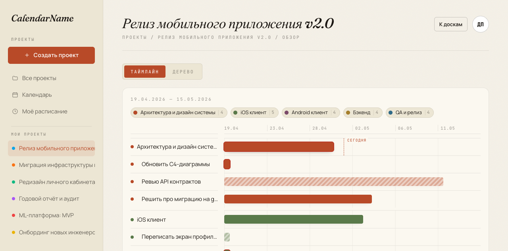
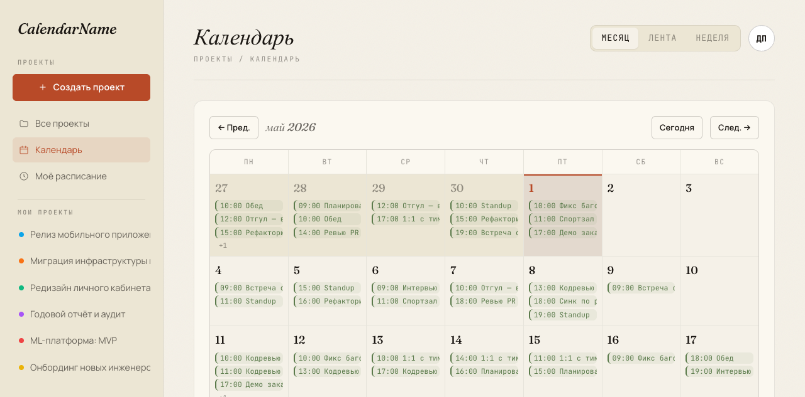
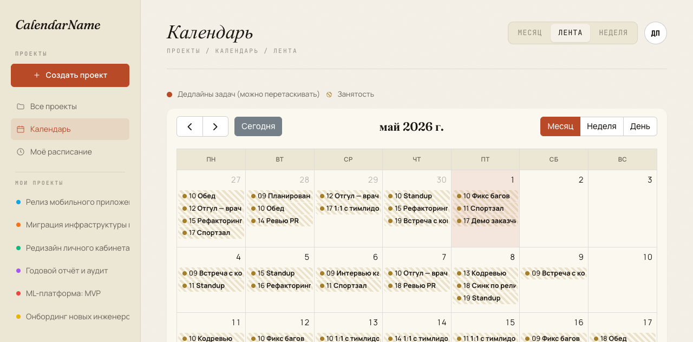
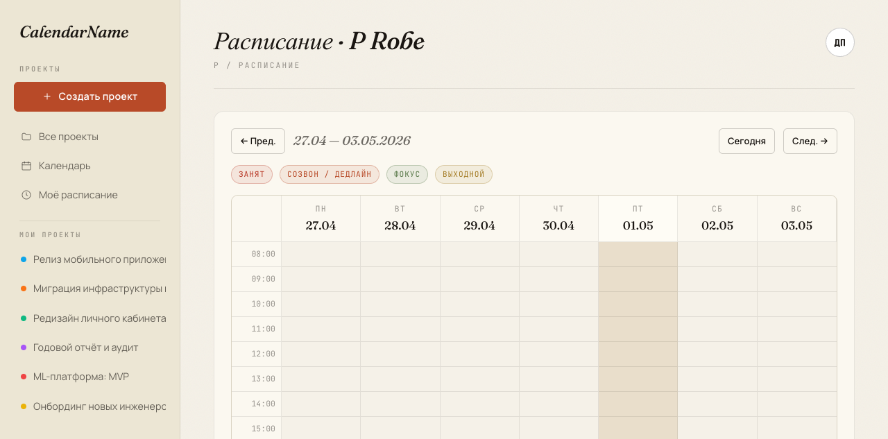
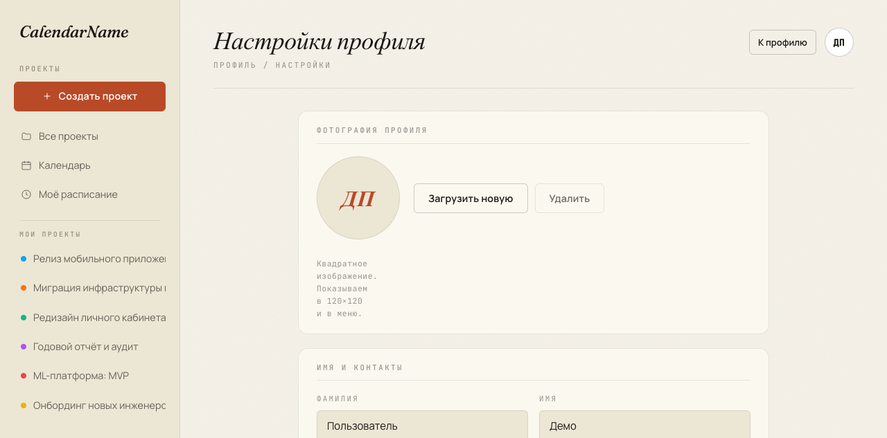
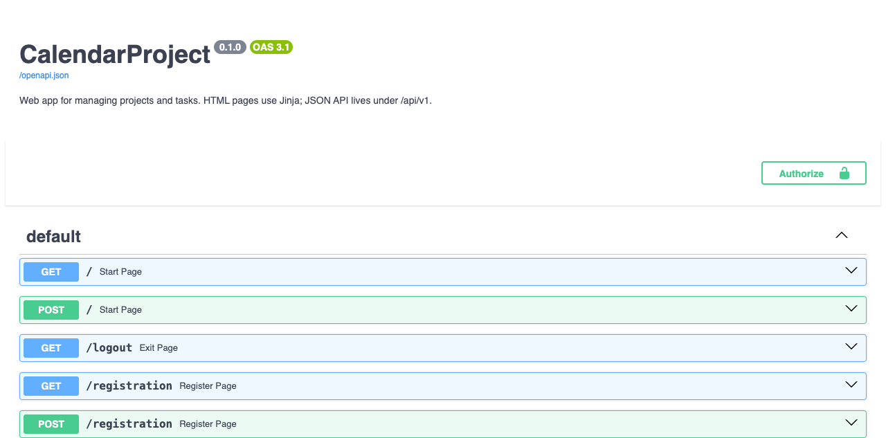

<!--
Просмотр:
  1. Просто открой как Markdown (читается без рендера).
  2. PDF:    npx @marp-team/marp-cli presentation.md -o presentation.pdf
  3. HTML:   npx @marp-team/marp-cli presentation.md -o presentation.html
  4. PPTX:   npx @marp-team/marp-cli presentation.md -o presentation.pptx

Скриншоты: положить в docs/img/, имена в плейсхолдерах ниже.
-->

---
marp: true
theme: default
paginate: true
size: 16:9
style: |
  section {
    background: #f5f1e8;
    color: #1a1612;
    font-family: -apple-system, system-ui, sans-serif;
  }
  h1, h2 { color: #b84a28; font-family: 'Fraunces', 'Times New Roman', serif; }
  code, pre { background: #ece6d4; color: #1a1612; }
  table { font-size: 0.85em; }
  blockquote { border-left: 4px solid #b84a28; padding-left: 1em; color: #5a4838; }
  .accent { color: #b84a28; font-weight: 600; }
  .small { font-size: 0.75em; color: #5a4838; }
---

<!-- _paginate: false -->

# CalendarProject

## Веб-приложение для управления проектами и задачами

**HSSE 25-26 · 2-й семестр**
Команда: vova2007mayorov · DanielWR25 · semended

<span class="small">FastAPI · async SQLAlchemy · PostgreSQL · Jinja + JSON-API</span>

---

## Лендинг и логин



- Стартовая страница `/` — форма входа + регистрация
- Краткие тизеры трёх ключевых фич (дерево / гант / расписание)
- Skolkovo light-cream темa: Fraunces (заголовки) + Manrope (текст)
- Полный auth-флоу: вход, регистрация, верификация email, восстановление пароля

---

## С чего начинали

**Стартовая точка (1-й семестр):**

- 🐍 Flask + `flask_login` + Jinja2
- 📄 Один `server.py` ≈ 390 строк
- 🗄 Plaintext пароли в БД
- 🔑 Хардкод `SECRET_KEY` в коде
- 🐘 Sync `psycopg2`, схема через ручной `CREATE TABLE`
- ❌ Тестов нет, CI нет

> «Один файл, всё в куче — работает, пока не нужно ничего менять.»

---

## Что стало

**Текущее состояние (`feat/migrate-to-fastapi` + `feat/calendar-view`):**

- ⚡️ **FastAPI** + Uvicorn (ASGI, async везде)
- 🧩 Модульная структура `app/` — 15 узко-тематических файлов
- 🔐 bcrypt + cookie-сессии + опциональный **JWT Bearer**
- 🐘 SQLAlchemy 2.0 **async** + asyncpg + `selectinload`
- 🛠 **Alembic** — единственный источник схемы
- 🎨 Полный **редизайн** UI (Skolkovo light cream)
- 🧪 **43/43** интеграционных теста на реальной Postgres
- 🤖 **CI** на GitHub Actions
- 📅 Интерактивный **календарь** (drag-n-drop дедлайнов)

---

## Стек

| Слой | Технология |
|---|---|
| API / web | FastAPI 0.115, Uvicorn, Starlette SessionMiddleware |
| ORM / БД | SQLAlchemy 2.0 async, asyncpg, PostgreSQL 15, Alembic |
| Валидация | Pydantic v2 (+ EmailStr) |
| Auth | bcrypt (passlib), PyJWT |
| Фронт | Jinja2 SSR, ванильный JS, FullCalendar.io 6.1 |
| Тесты | pytest, httpx, TestClient, реальная Postgres |
| CI / lint | GitHub Actions, ruff |
| Язык | Python 3.13 |

---

## Архитектура: гибрид Jinja + JSON-API

```mermaid
flowchart LR
    Browser -->|HTML| Jinja[Jinja routes<br/>app/routers/*]
    Mobile([Mobile / Swagger]) -->|JSON| API[/api/v1/*<br/>app/routers/api/*]

    Jinja --> Deps[deps.py<br/>get_current_user]
    API --> Deps2[deps.py<br/>get_current_user_api<br/>cookie OR JWT]

    Deps --> CRUD[crud.py<br/>permissions.py]
    Deps2 --> CRUD

    CRUD --> Models[(models.py<br/>SQLAlchemy ORM)]
    Models --> PG[(PostgreSQL<br/>asyncpg)]
```

**Ключевое решение:** Jinja и API делят одну cookie-сессию — нет двойной системы логина.

---

## Структура `app/`

```
app/
  main.py           — FastAPI app, middleware, роутеры
  database.py       — async engine, AsyncSession, get_db
  models.py         — User · Task · Roles · AvailabilitySlot
  schemas.py        — Pydantic v2 (UserMe, TaskCreate/Update/Response, ...)
  crud.py           — top-level async CRUD
  deps.py           — get_current_user (cookie + JWT)
  permissions.py    — RBAC с наследованием по дереву задач
  visibility.py     — privacy-фильтр публичного профиля
  availability.py   — слоты занятости + рендер недели/месяца
  jwt_auth.py · email.py · tokens.py · security.py
  routers/
    {auth,tasks,users}.py        — Jinja-страницы
    api/{auth,tasks,users,calendar}.py — JSON под /api/v1
```

---

## UI-1: главная — список проектов



- Карточки проектов (root-задачи, без подзадач)
- Цветовая метка + счётчики `tasks` / `members`
- Sidebar навигация (Проекты, Календарь, Расписание)
- Темa **Skolkovo light cream** (бумажная фактура, Fraunces + Manrope)

> Ссылка: `http://127.0.0.1:8080/main`

---

## UI-2: страница задачи



- Иерархия `parent_task_id` → подзадачи
- Команда + роли (Тимлид / Менеджер / Разработчик)
- Состояния: `todo · in_progress · review · done · paused`
- Computed-поле `status`: `active · overdue · completed`
- Кнопки управления видны по **permissions** (RBAC)

---

## UI-3: дерево + Gantt overview



`/task/{id}/overview` — рекурсивно собирает всё дерево подзадач и рендерит Gantt-stripe:

- Каждая ветка первого уровня → свой **track-цвет**
- Ширина бара = `(ended_at − created_at) / total_range`
- Вертикальная линия = «сегодня»
- Цвет статуса: `done`, `overdue`, `open`
- Легенда треков с количеством задач в цепочке

---

## UI-4: календарь (Месяц)



`/calendar` — месячный обзор:

- Дедлайны задач assignee
- Availability-слоты (busy / meeting / focus / off)
- Click на день → недельное расписание
- Skolkovo-стилизация (тёплые цвета, тонкие линии)

---

## UI-5: календарь — НОВОЕ (FullCalendar)



`/calendar/board` — интерактивный вью на **FullCalendar.io 6.1**:

- 🖱 **Drag-n-drop** дедлайнов прямо на сетке
- Переключение **Month / Week / Day**
- События тянутся через `GET /api/v1/calendar/events?from=&to=`
- PATCH через `/api/v1/calendar/events/task-{id}` с проверкой прав
- Локализация ru, тёмные акценты темы

---

## UI-6: недельное расписание



`/user/{id}/schedule` — недельная сетка по часам:

- Слоты `busy / meeting / focus / off` с цветовой кодировкой
- Дедлайны как авто-слоты (1 час с 9:00)
- Можно смотреть расписание коллег (с учётом privacy)
- Drag-n-drop добавления нового слота на пустой клетке

---

## UI-7: профиль и privacy



- 5 настраиваемых полей: `email · bio · position · company · workplace`
- 3 уровня: `public · authed · self`
- Применяется на публичной странице `/user/{id}`
- API `/api/v1/users/{id}` фильтрует ответ по тем же правилам

---

## REST API: Swagger UI



`/docs` — автогенерированная интерактивная документация:

- 18 эндпоинтов под `/api/v1`: auth · users · tasks · calendar
- Pydantic-схемы → JSON Schema → формы прямо в браузере
- Two-way auth: cookie session ИЛИ JWT Bearer (одинаково работают)
- ReDoc на `/redoc` для read-only-просмотра

---

## RBAC: permissions с наследованием

5 пермишенов на задачу:
`task.view · task.edit_settings · task.manage_members · task.create_subtask · task.delete_subtask`

3 ролевых пресета:
| Роль | Permissions |
|---|---|
| Тимлид | все 5 |
| Менеджер | view, edit_settings, create/delete subtask |
| Разработчик | view, create_subtask |

**Хитрость:** если у юзера нет роли на конкретной таске → `permissions.has_permission` поднимается по `parent_task_id` до корня. Не дублируем роли по подзадачам.

---

## Что закрыто за семестр

| Этап | Что | Коммит / факт |
|---|---|---|
| A–E | Flask → FastAPI миграция | модули, async, get_db |
| F | Alembic baseline | `85155a07e605` |
| G | Integration-тесты на реальной БД | `tests/conftest.py` |
| H | CI на GitHub Actions | pytest + ruff на push/PR |
| I | JWT Bearer для `/api/v1` | stateless auth + cookie |
| J | Email-confirm, password-reset, RBAC, privacy | `app/email.py`, `tokens.py` |
| K | Чистка deprecation-варнингов | — |
| L | Skolkovo light-cream редизайн | 250 строк legacy CSS вычищены |
| **NEW** | Календарь + drag-n-drop | сегодня |

---

## Тесты

```
$ pytest -v
tests/test_api_integration.py ............ 16 passed
tests/test_api_jwt.py             ......    6 passed
tests/test_api_smoke.py           .........  9 passed
tests/test_user_flows.py          ............ 12 passed
============================= 43 passed in 14.19s =============================
```

- Реальная Postgres `testdb_test` (фикстура поднимает + `alembic upgrade head`)
- `TRUNCATE … RESTART IDENTITY CASCADE` после каждого теста
- `NullPool` чтобы пережить `TestClient` event-loop swap
- Покрытие: auth, tasks CRUD, RBAC, JWT, calendar events, drag-n-drop

---

## Метрики проекта

| Метрика | Значение |
|---|---|
| Строк в `app/` | ≈ 1 500 |
| Шаблонов Jinja | 19 |
| API-эндпоинтов | 18 (под `/api/v1`) |
| Jinja-роутов | 14 |
| Моделей в БД | 6 |
| Alembic-миграций | 1 (baseline) |
| Интеграционных тестов | 43 |
| Зависимостей | 19 |
| Коммитов на ветке миграции | 30+ (этапы A–L) |

---

## Сегодня в работе: интерактивный календарь

**Что добавили:**

- `app/routers/api/calendar.py` — новый JSON-роутер
- `GET /api/v1/calendar/events?from=&to=` — события в формате FullCalendar
- `PATCH /api/v1/calendar/events/task-{id}` — drag-n-drop с правами
- `TaskUpdate.ended_at` + `crud.update_task_deadline`
- `templates/calendar_board.html` — FullCalendar 6.1 через CDN
- 5 новых интеграционных тестов

**Гранулярная безопасность:** каждое перетаскивание проверяет `task.edit_settings` через permissions inheritance. Чужую задачу подвинуть нельзя (тест возвращает 403).

---

## Roadmap: что дальше

🚧 **В работе:**
- `feat/calendar-view` → коммит → PR в upstream

📋 **Следующие фичи (в плане):**
1. **Канбан-доска** (`feat/kanban-board`) — колонки `todo / in_progress / done / overdue`, drag меняет `Task.state`. Без миграций.
2. **AI-разбивка задач** (`feat/ai-subtask-split`) — кнопка «разбить» → Claude API → автосоздание подзадач.
3. **Telegram-бот** — `/today`, `/create`, push-уведомления при назначении.
4. **Heatmap активности** в профиле (а-ля GitHub contributions).
5. **iCal-экспорт** `/api/v1/calendar.ics` — подписка из Google/Apple Calendar.

---

## Что узнали по ходу

- **Async — это не «добавить async везде».** `MissingGreenlet` в SQLAlchemy чинится `selectinload`, не интуитивно.
- **Pydantic v2 PATCH** — `Optional` не различает «не задано» vs «null». `model_fields_set` спасает.
- **Гибрид Jinja+API лучше чистого SPA для маленькой команды** — не нужно второй фронтенд-репозиторий.
- **Alembic с самого начала** — единственный sane source-of-truth для схемы. Старый `init_db()` хак с `IF NOT EXISTS` — путь в ад.
- **Тесты на реальной Postgres ловят миграционные баги**, моки бы пропустили.

---

## Демо-чек-лист (для ментора)

Запуск: `uvicorn app.main:app --reload`

1. `/main` — список проектов
2. `/task/{id}` — страница задачи + RBAC-кнопки
3. `/task/{id}/overview` — Gantt + дерево подзадач
4. `/calendar` — месячный календарь
5. **`/calendar/board`** — FullCalendar, перетащить дедлайн ⭐️
6. `/user/{id}` — публичный профиль (зайти из другого аккаунта → privacy фильтр)
7. `/docs` — Swagger UI, потыкать `/api/v1/calendar/events`
8. `pytest -v` — 43 зелёных
9. `git log --oneline` — этапы A–L

---

<!-- _paginate: false -->

# Спасибо

## Вопросы?

**Репозиторий:** `github.com/vova2007mayorov/CalendarProject`
**Ветка:** `feat/migrate-to-fastapi` + `feat/calendar-view`

<span class="small">CalendarProject · HSSE 25-26 · 2026 spring</span>
